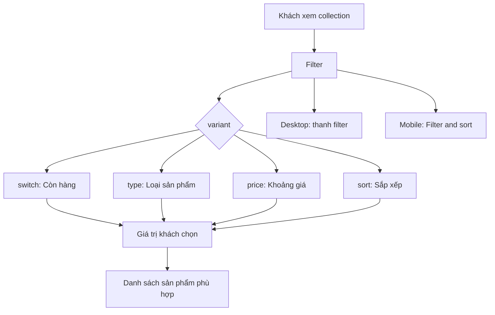

# Tổng quan bộ lọc sản phẩm

Bộ lọc giúp khách hàng thu hẹp hoặc sắp xếp danh sách sản phẩm trên các trang collection. Desktop đặt filter ngay trên danh sách; mobile gom cùng nội dung vào nút **Filter and sort**.



> Hiện tại filter đã quản lý giao diện và giá trị lựa chọn. Khi nối API/dữ liệu thật, giá trị này sẽ được dùng để cập nhật danh sách tại bước **Danh sách sản phẩm phù hợp**.

## Filter cha

`Filter` là điểm dùng chung. Nó nhận `variant`, sau đó chọn filter con phù hợp và chuyển các thông số còn lại đến filter con đó.

| Prop | Bắt buộc | Ý nghĩa |
| --- | --- | --- |
| `variant` | Có | Chọn loại filter: `"switch"`, `"type"`, `"price"` hoặc `"sort"`. |

`Filter` không có prop để chọn desktop/mobile. Mỗi filter con tự hiển thị cả hai giao diện bằng responsive utility của Tailwind CSS: `max-sm:hidden` cho desktop và `sm:hidden` cho mobile.

### Cách dùng Filter cha

```tsx
<Filter variant="price" min={0} max={274} step={1} currency="USD" />
```

Ngoài `variant`, prop hợp lệ phụ thuộc vào loại filter được chọn, như các phần bên dưới.

## FilterMobileGroup

`FilterMobileGroup` chỉ dùng để gom các `Filter` vào sheet trên mobile. Nó tạo nút **Filter and sort** ở giữa màn hình và hiển thị mỗi filter trong một mục có thể mở/đóng.

| Prop | Bắt buộc | Ý nghĩa |
| --- | --- | --- |
| `children` | Có | Các `<Filter />` cần xuất hiện trong mobile sheet. |
| `className` | Không | Class bổ sung cho vùng đặt nút mobile. |

```tsx
<FilterMobileGroup>
  <Filter variant="switch" label="In stock only" />
  <Filter variant="sort" items={["best selling", "price, low to high"]} />
</FilterMobileGroup>
```

## Filter con

Mỗi filter con có một nhiệm vụ riêng. Tất cả đều đã xử lý responsive bằng Tailwind CSS trong chính component của mình: desktop và mobile dùng nội dung tương ứng, không cần truyền prop `presentation`.

### `switch` — lọc còn hàng

Người mua bật/tắt để chỉ xem sản phẩm có thể mua ngay. Khi bật, component có thể hiện nhãn trạng thái và nút xóa lựa chọn.

| Prop | Bắt buộc | Ý nghĩa |
| --- | --- | --- |
| `label` | Có | Tên lựa chọn, ví dụ `"In stock only"`. |
| `activeLabel` | Không | Nhãn hiển thị khi đang bật; mặc định dùng `label`. |
| `checked` | Không | Trạng thái bật/tắt do page quản lý. |
| `defaultChecked` | Không | Trạng thái ban đầu khi component tự quản lý; mặc định `false`. |
| `onCheckedChange` | Không | Nhận trạng thái mới mỗi khi khách bật/tắt. |
| `onClear` | Không | Được gọi khi khách xóa trạng thái đang bật. |
| `showActiveBadge` | Không | Có hiện nhãn trạng thái sau khi bật hay không; mặc định `false`. |
| `clearable` | Không | Có cho phép xóa trạng thái từ nhãn hay không; mặc định `true`. |
| `disabled` | Không | Vô hiệu hóa thao tác. |
| `description` | Không | Mô tả ngắn bên dưới nhãn. |
| `id` | Không | Định danh cho switch; tự tạo nếu bỏ trống. |
| `labelPosition` | Không | Vị trí nhãn: `"left"` hoặc `"right"`; mặc định `"left"`. |
| `switchType` | Không | Kiểu hiển thị của switch; mặc định `"button"`. |
| `badgeProps` | Không | Tùy chỉnh badge trạng thái. |
| `clearButtonProps` | Không | Tùy chỉnh nút xóa trạng thái. |
| `rootClassName` | Không | Class cho vùng ngoài cùng. |
| `labelClassName` | Không | Class cho nhãn. |
| `descriptionClassName` | Không | Class cho phần mô tả. |

`switch` cũng nhận các prop hiển thị chuẩn còn lại của component Switch, trừ các prop đã được quản lý ở bảng trên. Desktop hiển thị switch và badge trạng thái; mobile hiển thị switch trong mục Availability.

```tsx
<Filter
  variant="switch"
  label="In stock only"
  activeLabel="In Stock"
  defaultChecked={false}
  showActiveBadge
/>
```

### `type` — lọc loại sản phẩm

Người mua chọn loại sản phẩm như Insert hoặc Accessories. Mỗi lựa chọn đi kèm số sản phẩm hiện có.

| Prop | Bắt buộc | Ý nghĩa |
| --- | --- | --- |
| `items` | Có | Danh sách loại sản phẩm. Mỗi item gồm `id` (mã duy nhất), `label` (tên hiển thị) và `count` (số lượng). |
| `title` | Không | Tên nhóm; mặc định `"Product"`. |

Desktop hiển thị nút mở danh sách loại sản phẩm; mobile hiển thị các checkbox trong mục Product type. Hai giao diện này được điều khiển bằng Tailwind CSS trong cùng component.

```tsx
<Filter
  variant="type"
  title="Product"
  items={[{ id: "insert", label: "Insert", count: 12 }]}
/>
```

### `price` — lọc khoảng giá

Người mua kéo để chọn mức giá thấp nhất và cao nhất phù hợp với ngân sách.

| Prop | Bắt buộc | Ý nghĩa |
| --- | --- | --- |
| `min` | Có | Giá thấp nhất được phép chọn. |
| `max` | Có | Giá cao nhất được phép chọn. |
| `currency` | Không | Đơn vị tiền: `"USD"` hoặc `"VND"`; mặc định `"USD"`. |
| `currencyLabel` | Không | Nhãn tiền tùy chỉnh, thay cho nhãn tự tạo. |
| `locale` | Không | Định dạng số theo khu vực; tự chọn theo `currency` nếu bỏ trống. |
| `step` | Không | Bước thay đổi giá; mặc định `1`. |
| `defaultValue` | Không | Khoảng giá ban đầu, dạng `[min, max]`. |
| `value` | Không | Khoảng giá do page quản lý, dạng `[min, max]`. |
| `onValueChange` | Không | Nhận khoảng giá mới khi khách kéo thanh giá. |
| `title` | Không | Nhãn của filter; mặc định `"Price"`. |
| `disabled` | Không | Vô hiệu hóa thao tác. |

Desktop hiển thị nút Price mở lựa chọn; mobile hiển thị thanh kéo cùng hai ô giá. Hai giao diện này được điều khiển bằng Tailwind CSS trong cùng component.

```tsx
<Filter
  variant="price"
  min={0}
  max={283500}
  step={5000}
  currency="VND"
  onValueChange={(range) => console.log(range)}
/>
```

### `sort` — sắp xếp sản phẩm

Người mua đổi thứ tự danh sách, ví dụ theo bán chạy hoặc theo giá.

| Prop | Bắt buộc | Ý nghĩa |
| --- | --- | --- |
| `items` | Có | Danh sách các lựa chọn sắp xếp, ví dụ `"best selling"` hoặc `"price, low to high"`. |

Nếu danh sách có `"best selling"`, đây là lựa chọn ban đầu; nếu không, lựa chọn đầu tiên sẽ được dùng. Desktop dùng menu chọn; mobile dùng các checkbox trong mục Sort by. Hai giao diện này được điều khiển bằng Tailwind CSS trong cùng component.

```tsx
<Filter
  variant="sort"
  items={["featured", "best selling", "price, low to high"]}
/>
```
